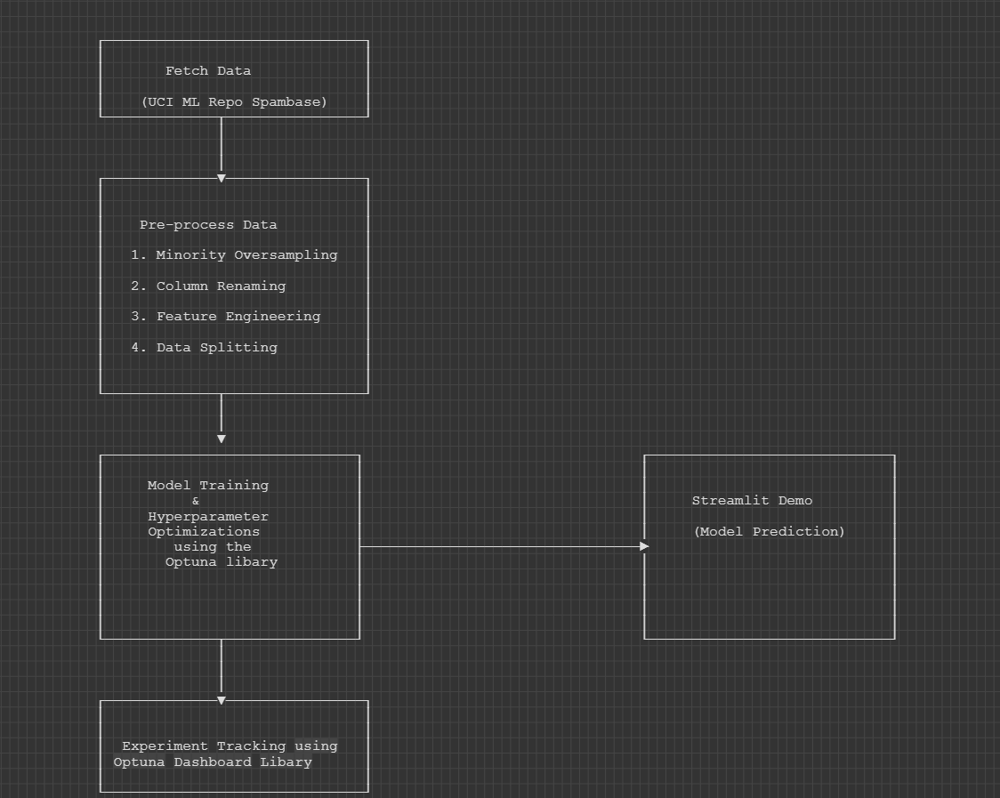
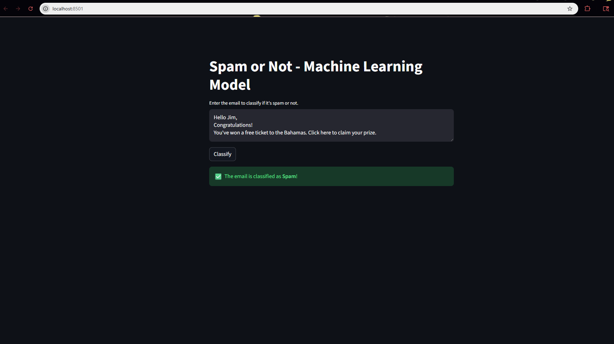
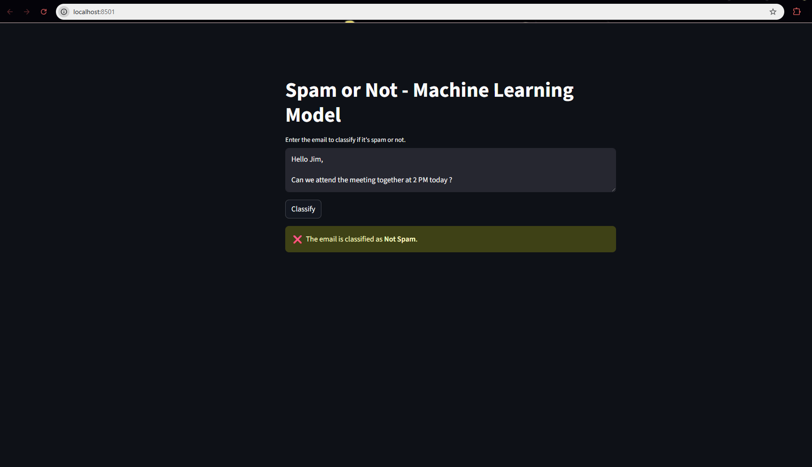
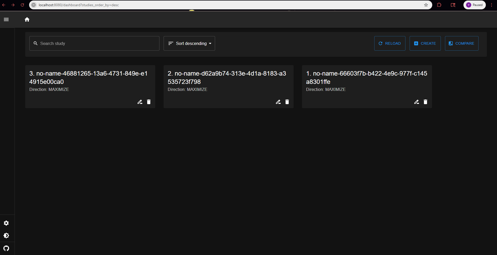
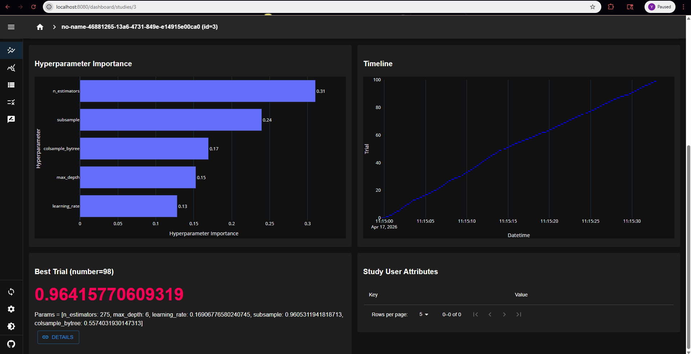
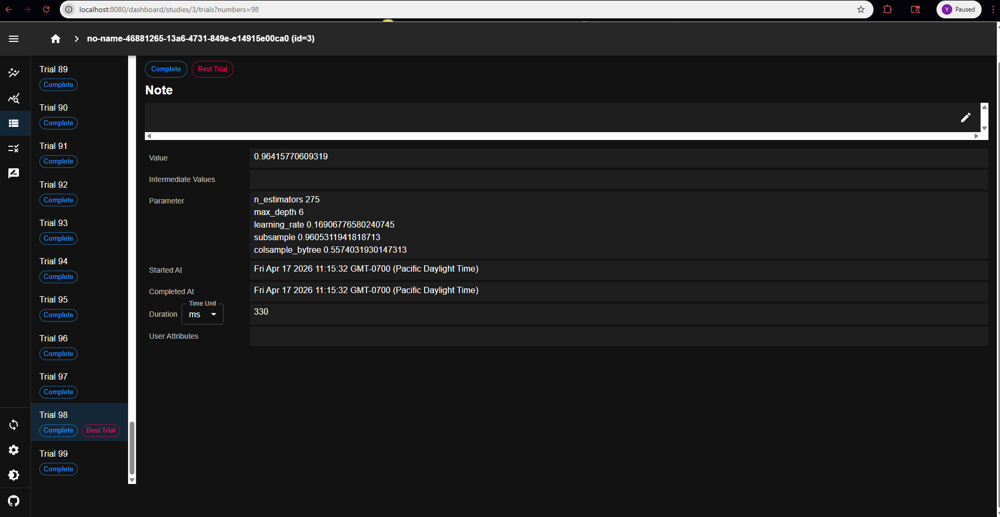

# spamOrNot :email:
A Machine Learning use-case for detecting if an incoming email is spam or not. The problem type is of binary classification. 

## Tech Stack :books:
```
1. Python - Programming language
2. VSCode - local development
3. Streamlit - UI + demo
```
## Skills :book:
```
1. Python
2. Statistical Analysis
3. Data Analysis
4. Feature Engineering
5. Machine Learning
6. Hyperparameter Optimization
7. XGBoost 
8. Supervised Learning
9. Git
```

## Pre-requisites :black_nib:
```
Python : 3.14.4 
Visual Studio Code 
```
## Input Data :open_file_folder:
We are opting for the Spambase dataset from the UCI Machine learning repository.
You can navigate to the link here to understand more about the data:
[Spambase](https://archive.ics.uci.edu/dataset/94/spambase)

## Problem Type :round_pushpin:

Since we have two classes - 0 ( Not Spam ) and 1 ( Spam ), we have the problem for 'Binary Classification'

## Model Choice :dart:

We choose XGBoost as a model choice for the following reasons:
- EDA ( `data/cleaning.ipynb` ) indicates a large number of zeros making the data sparse
- XGBoost or Tree-based methods provide good results for this use-case
- Pre-existing framework in Python - compatible with Optuna also
- As per Baseline Model Performance, XGBoost performs best as can be seen [here](https://archive.ics.uci.edu/dataset/94/spambase) under the `Model Performance` section.

## Get Started 🚀  
To get started, simply run the `deploy.sh` script which will allow you to do the following:
```
1. Create and initialize a virtual environment
2. pip install the requirements
3. Train the model and generate : .pkl file, Optuna dashboard
4. Provide you with a localhost UI to test your model
5. Provide you with a localhost UI to track your experiments
```

To run the script:
```
git clone https://github.com/yashMaheshBangera/spamOrNot.git
cd spamOrNot
chmod +x deploy.sh
./deploy.sh 
```
Note: for users on powershell, instead of the last 2 lines above, simply run `.\deploy.ps1`

Once done, you can navigate to the streamlit UI by going to your browser and typing `http://localhost:8051`

You can also view the hyperparameter optimizations using the Optuna Dashboard library.
This can be done using the command below:
```
optuna-dashboard sqlite:///optuna_study.db
```
It will be accessible via this URL : `http://localhost:8080`
## Python Libaries used :floppy_disk:

We have used the following libraries for this project:
| Package Name | Link | Purpose | 
| ------------ | ---- | ------- |
| ucimlrepo    | https://github.com/uci-ml-repo/ucimlrepo | Dataset is fetched using this |
| imbalanced-learn | https://imbalanced-learn.org/stable/ | Minority oversampling |
| scikit-learn | https://scikit-learn.org/stable/ | Splitting the Data into train, test and validation |
| pandas       | https://pandas.pydata.org/       | For EDA, feature engineering and data processing |
| numpy        | https://numpy.org/               | For Log Transformation to fix skewness ( Check cleaning.ipynb) |
| xgboost      | https://xgboost.readthedocs.io/en/release_3.2.0/install.html | Machine Learning Model for Classification |
| optuna       | https://optuna.org/ | Hyperparameter Optimization |
| optuna-dashboard |  https://optuna.org/#dashboard | Experiment tracking |
| streamlit | https://streamlit.io/ | UI development and local hosting |


## Understanding what you deployed :pushpin:

1. Steps 1 and 2 above will install libraries necessary to run the code
2. Step 3 will do the following : 
  - Run the file `hyperparameter_tuning/optuna_tuning.py` 
  - Flow followed will be: 
                                                              
  - You can view the best performing model from the Optuna Tuning in your `hyperparameter_tuning` folder saved as `best_model.pkl` file
  - You will also be able to see a file named `optuna_study.db` file. This is a Relational DB file ( SQLite Format ) used to persist the optimization history of an Optuna study.
3. Step 4 will take you to a demo where you can input an email string that you want to classify. You can view examples in the images below: 


4. As mentioned in Step 3, the Optuna Study creates a file named `optuna_study.db` within the `hyperparameter_tuning` dir. This file will be used to load the UI for the `optuna-dashboard` command mentioned in the `Getting Started` section. An example is shown here:



You can also click 'Details' to get more info on each trial:


Note: You can also review the `data/cleaning.ipynb` notebook for analysis performed on data

## Conclusion :sparkles:

We were able to tune the XGBoost Algorithm with the help of a technique called Hyperparameter Optimization. This was performed using Optuna. Results show an overall accuracy of ~96%. 

## Author

Yash Mahesh Bangera <br>
Email: yashmaheshbangera.work@gmail.com
